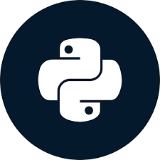

# Python
 
 

 
 

## What is Python ?
 
Python is a high-level, interpreted programming language that was created by Guido van Rossum and first released in 1991. It is known for its simplicity, readability, and versatility, making it a popular choice for a wide range of applications, including web development, data analysis, scientific computing, artificial intelligence, automation, and more.

Key features of Python include:

1. **Readable Syntax:** Python's syntax is designed to be human-readable and straightforward, which makes it easier to write and understand code. This has contributed to Python's popularity among both beginners and experienced developers.

2. **Interpreted:** Python is an interpreted language, meaning that code is executed line by line by an interpreter, rather than being compiled into machine code before execution. This allows for rapid development and testing.

3. **Dynamically Typed:** Python is dynamically typed, which means you don't need to explicitly declare variable types. The interpreter determines the data type of a variable during runtime.

4. **Large Standard Library:** Python comes with a vast standard library that provides modules and functions for a wide range of tasks, such as file I/O, networking, regular expressions, and more. This reduces the need to write code from scratch for common operations.

5. **Cross-Platform:** Python is cross-platform, meaning it can run on various operating systems (Windows, macOS, Linux) without modification.

6. **Open Source:** Python's source code is freely available, and the language is developed collaboratively by a community of programmers. This has led to a vibrant ecosystem of third-party libraries, frameworks, and tools.

7. **Object-Oriented:** Python supports object-oriented programming, allowing you to structure your code using classes and objects.

8. **Versatile:** Python can be used for a wide variety of tasks, from scripting small tasks to building complex applications. It's commonly used in web development (with frameworks like Django and Flask), data analysis (with libraries like NumPy and pandas), machine learning (with libraries like TensorFlow and scikit-learn), and more.

Python's simplicity and flexibility have contributed to its popularity, especially in educational settings and industries where rapid development is essential. It's often recommended as a first programming language for beginners due to its gentle learning curve and extensive resources available for learning and troubleshooting.